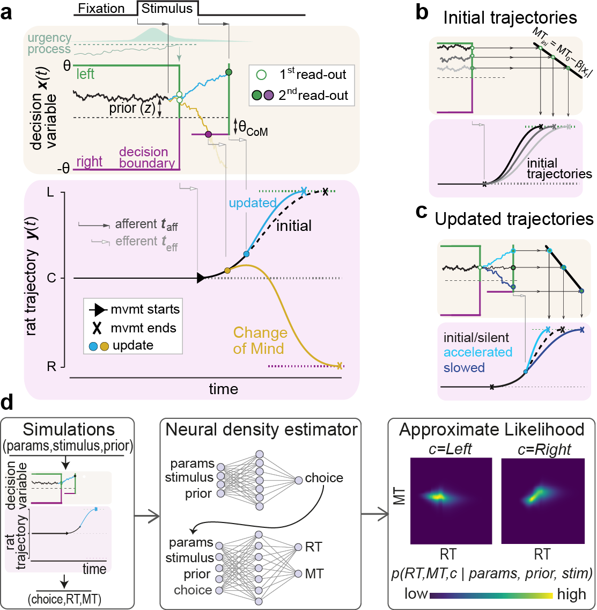

# rapid-updating-of-movement-by-evidence
Repository for the paper ["Rapid, systematic updating of movement by accumulated decision evidence"](https://www.biorxiv.org/content/10.1101/2023.11.09.566389v2) by Manuel Molano-Mazón, Alexandre Garcia-Duran, Jordi Pastor-Ciurana, Lluís Hernández-Navarro, Lejla Bektic, Debora Lombardo, Jaime de la Rocha & Alexandre Hyafil.



Please report any bug / missing function.

### Notebooks
We set up two [`notebooks`](notebooks):
- [```Figures.ipynb```](notebooks/Figures.ipynb): in which you will be able to load the data, available [here](https://osf.io/794vk/), and reproduce the main figures from the manuscript. All details from data are in the link provided and in the notebooks.
- [```MNLE_fitting_pipeline.ipynb```](notebooks/MNLE_fitting_pipeline.ipynb): in which you will see and play with the fitting procedure, starting from training a Mixed Neural Likelihood Estimator (MNLE, [Boelts et al. 2022](https://elifesciences.org/articles/77220)), and finding the approximate Maximum Likelihood Estimate with Bayesian Adaptive Direct Search (BADS, [Acerbi and Ma, 2017](https://papers.nips.cc/paper_files/paper/2017/hash/df0aab058ce179e4f7ab135ed4e641a9-Abstract.html)).

### Scripts
We saved the ```.py``` scripts used in the project in the corresponding folder, so all code is available.

### Figs:
This folder contains the schematics (in .png) shown in the main figures. Needed in ```Figures.ipynb``` notebook for correct reproduction of main figures.

### Requeriments
- ```sbi```: [Tejero-Cantero et al., (2020)](https://joss.theoj.org/papers/10.21105/joss.02505), in which MNLE is developed. [Github](https://github.com/sbi-dev/sbi).
- ```pybads```: [Singh et al., (2024)](https://joss.theoj.org/papers/10.21105/joss.05694), [Github](https://github.com/acerbilab/pybads).

To run the notebooks locally, download the [data](https://osf.io/794vk/), and run
```
pip install -r requirements.txt
``` 


### Citation
```
@Article{MolanoMazon2023,
  author    = {Molano-Mazón, Manuel and Garcia-Duran, Alexandre and Pastor-Ciurana, Jordi and Hernández-Navarro, Lluís and Bektic, Lejla and Lombardo, Debora and de la Rocha, Jaime and Hyafil, Alexandre},
  title     = {Rapid, systematic updating of movement by accumulated decision evidence},
  year      = {2023},
  month     = nov,
  doi       = {10.1101/2023.11.09.566389},
  publisher = {Cold Spring Harbor Laboratory},
}
```
